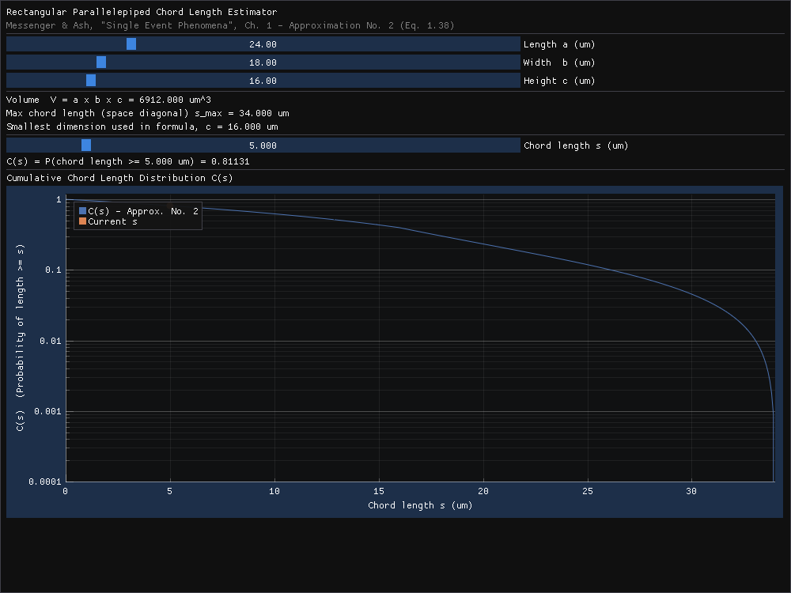

# URSA — Chord Length Distribution Estimator

Interactive chord length distribution estimator for a rectangular volume
(Messenger & Ash, *Single Event Phenomena*, Eq. 1.38), built with
[Dear ImGui](https://github.com/ocornut/imgui) and
[ImPlot](https://github.com/epezent/implot).

`cmake` `cpp` `glfw` `imgui` `implot` `opengl` `physics-simulation`
`radiation-effects` `single-event-effects`



## Background

Implements **Approximation No. 2 (Eq. 1.38)** for the cumulative chord
length distribution `C(s)`, from:

> G. C. Messenger and M. S. Ash, *Single Event Phenomena*, Chapter 1,
> Section 1.4 "Chord Distribution Functions".

For a box with dimensions `a`, `b`, `c` (where `c` is the smallest
dimension) and space diagonal `s_max = sqrt(a^2 + b^2 + c^2)`:

```
k = 2.37c / (1.80c + s_max)

C(s) = (1 - k) * (s_max^3.8 - s^3.8) / (s_max^3.8 - c^3.8) * (c/s)^2   for s >= c
C(s) = 1 - k * (s/c)                                                   for s <  c
```

`C(s)` is the probability that a randomly oriented, isotropic particle
track chord through the volume has length `>= s`.

## Building

Requires CMake 3.16+, a C++17 compiler, and OpenGL/X11 development
headers (on Debian/Ubuntu: `libgl-dev libx11-dev libxrandr-dev
libxinerama-dev libxcursor-dev libxi-dev libxkbcommon-dev`). GLFW,
Dear ImGui, and ImPlot are fetched automatically via CMake
`FetchContent` — no manual dependency setup needed.

```sh
cmake -S . -B build -DCMAKE_BUILD_TYPE=Release
cmake --build build -j$(nproc)
```

## Running

```sh
./build/chord_length_estimator
```

This opens a window with sliders for the box dimensions `a`, `b`, `c`
and a chord length probe `s`, live readouts of the volume, `s_max`,
and `C(s)`, and a log-scale plot of `C(s)` across the full chord
length range.
